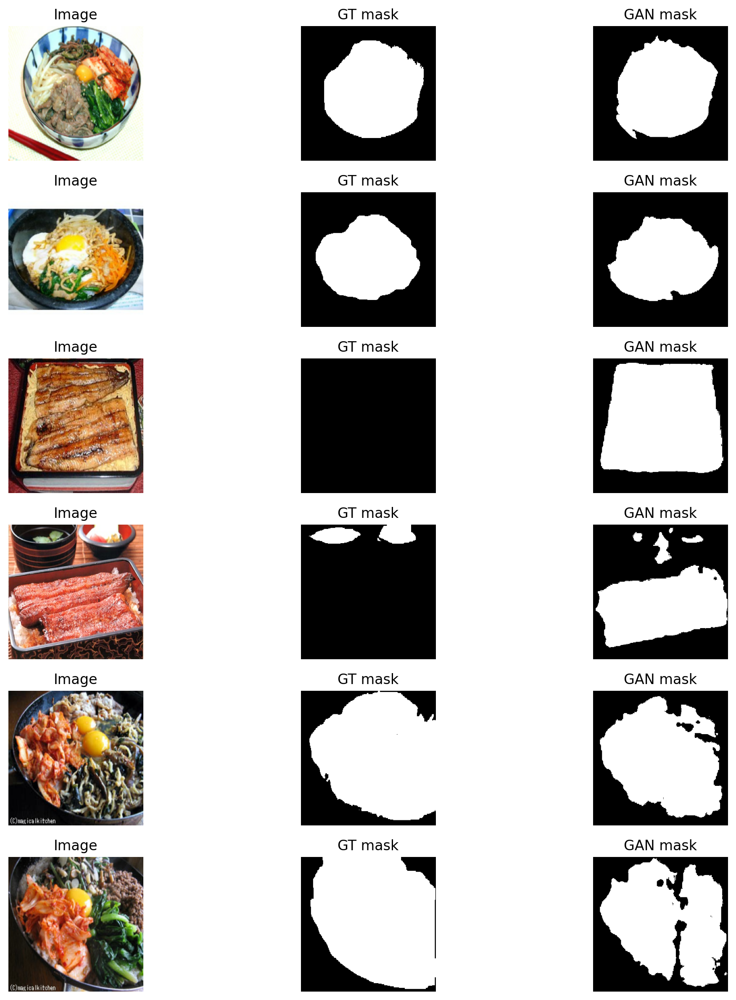
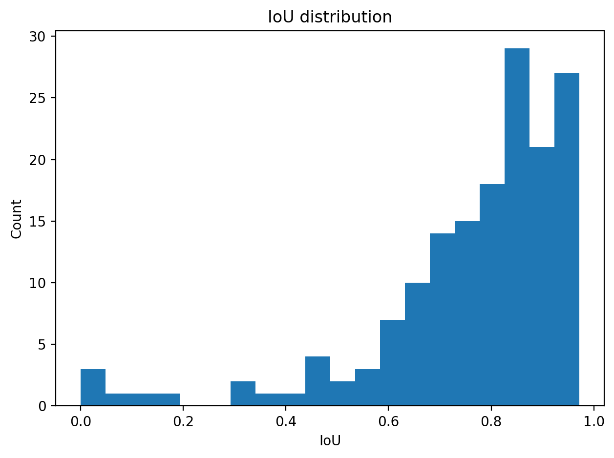
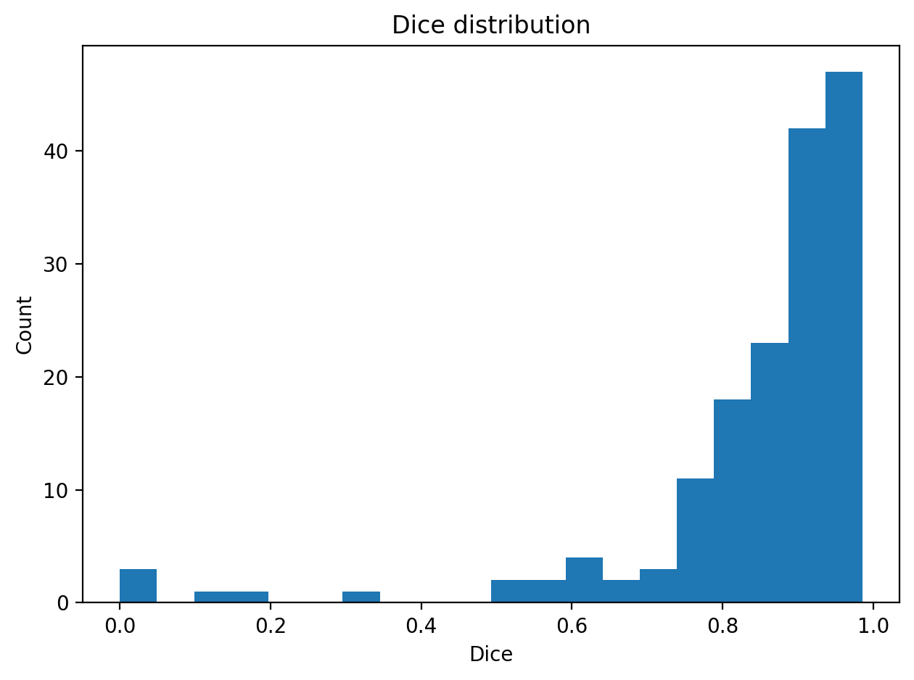
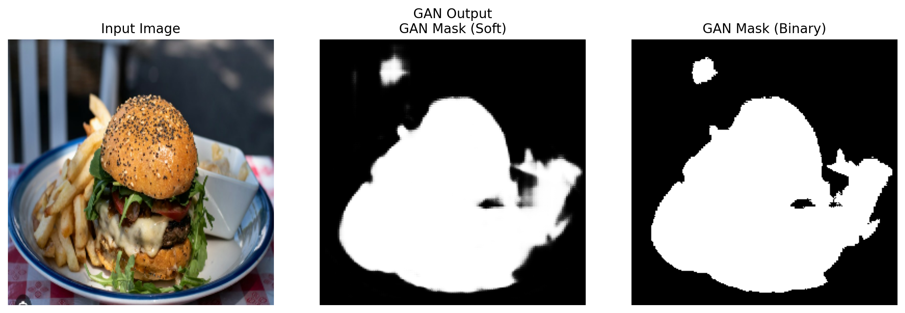
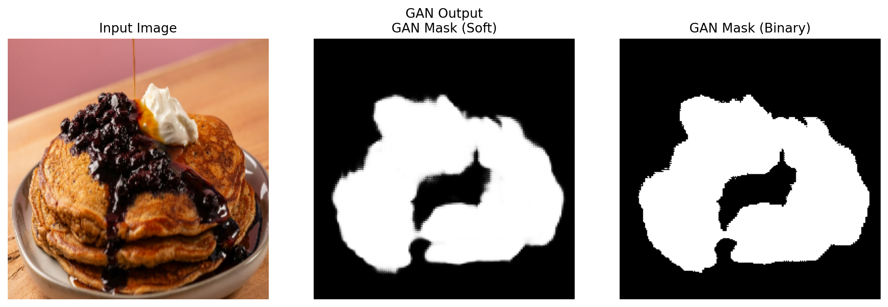
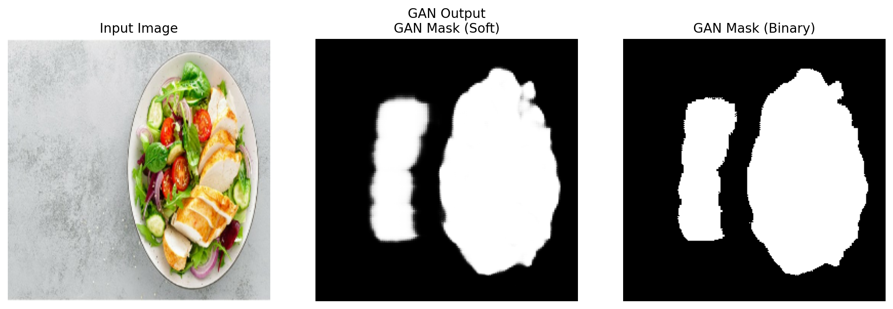
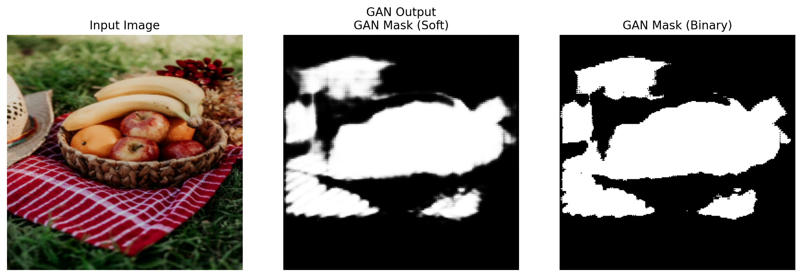
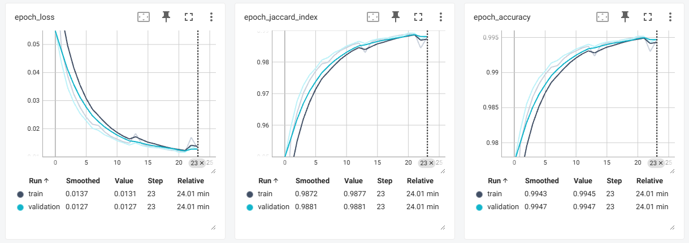
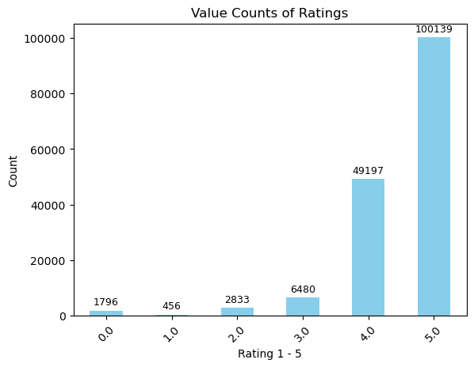

# Integration Report

## The Application

Our application is a food and flavor identifier. The user can input a photo of some food and a text description of the ingredients. It begins by using the GAN model to identify where food is in an image and create a segmentation mask. The autoencoder uses this output and tweaks the boundaries on the food masks. This makes it easier for the CNN to classify the food in the image. Finally, the NLP can take this classification or the user text input to generate a flavor score and profile for the food.

## GANs

Initially, a 5GB dataset was found to use for training the GAN. After significant research into the best way to handle this, it was decided to use a smaller (though still large) dataset that was 758MB. This dataset was downloaded from an academic server in Asia at a very low upload speed, taking almost a full hour to download. Vscode colab extension was not able to access local files, nor could it mount google drive. After more internet research revealing this to be a known issue, the final solution ended up being to host the file on google drive and run the 3_gan_segmentation jupyter notebook directly in Colab to build and train the model.  The saved model was then downloaded, saved into vscode file structure, and uploaded to github through gitbash. We needed to use Colab to run the models, but Colab is not able to read from datasets stored locally. By saving the models as .keras files, we only had to build and train the model once. However this also meant that if any of the other team members wanted to rerun/train the model, they would need to download and load the entire dataset to their own personal Google Drive again, and change the file path directory in the gan notebook. 

I tested the trained GAN on test data and created representative images of both good and bad model outputs compared to the ground truth. In some cases, the ground truth segmentation is actually not very good! This was surprising, as this dataset was specifically an "improved" version of the dataset which is part of an academic lab's work. The test data outputs were generated in colab and saved to my Google drive, and downloaded for inclusion here.

In these images you can see that there's some decent matching in most cases, but it's not great.  Playing around with architecture and number of training epochs could likely improve this, but the scope of this project is limited due to time constraints and needing to connect to group members' code early to get things working as a group project.

The IoU is the Intersection over Union Jaccard Index, and it measures the pixels correctly predicted as food, divided by all pixels predicted as food in either the prediction or Ground Truth. A histogram chart showing the IoU values for all images test images shows that most are between ~60% and ~95% IoU value range.  According to the internet, this is pretty good actually.

The Dice metric is similar to IoU, except that it takes into account the relative size of the food region. This is useful when food images are small and the background dominates. It is very commonly used to evaluate segmentation. In our GAN, most segmentation masks have a Dice score of ~80 or greater, which is very good.

In order to integrate the GAN into the system, I created some codes that would load the GAN model, take in user input of a photo, and output the segmentation mask to be sent to the autoencoder.  Since the autoencoder code was not complete yet, I didn't assign the output and tried to communicate the placeholder to Justin. It sounds like this message was not communicated well because Justin had trouble picking up where I left off, and unfortunately I was not available later in the project.  The GAN app_pipeline.py test I created took in 4 images I screenshotted from the internet, created and saved masks and generated output images for each. In included a central image of the GAN output before binarization as well.

Overall there is room for improvement but as for a minimum viable product, the code functions as designed.

## AE

Working in my solo notebook was mostly fine, but I was getting very lost when trying to integrate the Autoencoder into a bigger system.  I used chatgpt to help me organize my code into a module so that exporting the features of my notebook would be clear and easy.  Then, when trying to wire the autoencoder up with the GAN I was having import issues in Colab since mounting the drive wasn't working the way I expected it to.  When I tried to run the code locally, the output of my cells in the application file froze.  Ultimately, I didn't get to incorporating my AE with Ashley's GAN, but all of the pieces and parts to do so are currently set up.

The autoencoder does some very fine tweaks to the mask, but assumes the masks are accurate.  It is limited by whatever the GAN function does, and assumes the mask is operating correctly.  

Another challenge with understanding Autoencoders is knowing which metrics are important.  I started with what we did in the labs with autoencoders and used accuracy to measure performance.  Further research about autoencoders and masks I learned that Jaccard Index or Intersection over Union (IoU) is a more important metric with these types of models.  Specifically, because the jaccard index is a measure of the intersection percentage of the masks and doesn't care about the True Negatives, which in the case of a mask, is the similarity outside the mask (the background).  Accuracy could give you a high accuracy even with very different masks if the entire image space is only comprised of a small mask because all the negative space is counting towards good accuracy.  IoU is specifically measuring the similarity of the mask itself.

An improvement that could be made is the way noise is being added to the autoencoder.  I don't know if the noisy mask is noisy enough - but I wanted to try writing my own noise creating function.  I would probably change this in a future iteration.

Another improvement in my process of building an autoencoder would be to not rely solely on early stopping with something like loss.  The autoencoder requires some measure of intervention - something like checking visuals every few epochs - and deciding when the image is smoothed enough.  I think since I trained my model to keep working until the loss wasn't improving after three epochs, the model makes very tiny tweaks to the mask, and it could have maybe been slightly more general.  In the image below, you can see how the jaccard index tapers off and it is above 98%.  That means the autoencoded mask and the input clean mask are 98% similar.  I could have been checking what it looks like at an earlier point.

## CNN

The biggest problem with integrating CNN was ensuring that the input would accept the mask along with ensuring that it took both inputs. Training of the CNN was done prior to any mask data, so there could be issues where it might not perform as well on the mask input. But since the pipeline is there, it could be retrained to ensure it performs well with the mask. Training for the CNN took a really long time, and I only did 10% of the dataset as training. But if the entire dataset was used, it could possibly take hours.

I did initially have some issues with input preprocessing, not keeping the same format throughout the pipeline and the dataset being to large to test a pipeline with. I had to change to make sure things were normalized. Once I got that down though, the accuracy did bump up, but I still had some training issues with getting fine-tuning accuracy above 60%, which is still pretty low. Mostly everything continued to improve the longer it trained, but it did take awhile.

Working with saving each step of the process did help, but on a local system this would be significantly faster than trying to load data back and forth. 

The CNN could be slow in a real-time application because it needs to have low latency, plus the resource cost is likely going to be high, unless somehow the model could be shrunk. There could be some memory constraints as well, due to the high resources. Something like this may not work on something smaller like a phone with limited resources. Plus, with the current low accuracy of the CNN, for lower classifications, there could be issues with producing the incorrect categorizations. If using the top 10 categories or top 5 categories, there is a high likelihood that it would be correct. There could be a fallback mechanism when CNN confidence is low. 

## NLP - Food Rating and Text Generation

The NLP portion of the application has two parts. The first, **the NLP Food Rating model,** that uses recipe ingredients and the average rating of each recipe to predict the rating or "flavor level" of ingredient groupings. The ingredients are encoded based on their frequency and the text input is mapped to these encodings.

I built this model first to serve as an MVP and to get a better understanding of the dataset. I was planning on using the recipes steps and descriptions that were already preprocessed, but then I realized that I didn't understand how they were being preprocessed and I wouldn't be able to apply the same preprocessing to the user input. There is [a paper](https://aclanthology.org/D19-1613.pdf) that goes over how this dataset was collected and tokenized using Byte-Pair Encoding, but given the limited time I decided to use the included ingredient mappings.

One issue with the NLP Food Rating model is that it predicts almost everything as tasting good (4 or 5 rating). This is could be due to the dataset being a recipe dataset, so all of the ingredient groupings were good enough that someone decided to share them online and thus the average ratings were relatively high.

If I had more time I would have explored resolving the data set imbalance. The first option could be trying to change how the dataset was preprocessed. Instead of using unique ingredient grouping and it's corresponding average rating, I could have included every rating and allowed repeat ingredient groupings. I also could have looked into using SMOTE to balance the dataset classes.

The second, **the NLP Food Text model,** uses recipe descriptions to generate text. For this model I followed [this tutorial](https://www.tensorflow.org/text/tutorials/text_generation). The recipe descriptions are vectorized at a character level and the model tries to generate the next character based on the previous character.

The goal for the NLP Food Text model was to generate a flavor profile. The user could input a list of ingredients, such as "lime juice, ginger beer, vodka", and the model would describe it's flavor profile as "refreshing, citrusy". However, the model currently can only generate nonsense. While building this model, I quickly realized that I was unsure of how to finetune it to create the desired outputs.

## Perfomance

The autoencoder and GAN performed the best out of the 4 models. The autoencoder has an accuracy score of ~0.99 and Jaccard index of 0.98. The GANs had an average Jaccard index of ~0.76, which is in the range of very good >0.75. GAN segmentation image results show some inconsistent results, with some imaginary food areas appearing, but largely the food area matches the general location of actual food.

The CNN and NLP models did not perform as well. They both had accuracy scores in the 0.6 range. 

## Ethical Concerns

One of the potential harms of our project comes from our choice in dataset. The image dataset might be skewed towards American centric foods and therefore non-American food may not be accurately classified by the CNN. Additionally, the autoencoder, which treats outlying patterns as noise, might overgeneralize the data - reducing the data to what is popular rather than reflecting diversity. The same risk exists with the recipe and interactions dataset. It could have culturally biased opinions in them, such as a stronger preference for American food over non-American food.

Additionally, because the multiple deep learning models are dependent on each (the autoencoder uses the output of the GANs, the CNN uses the output of the autoencoder) the bias that is baked in during one step of the process could be amplified during the next step. Although the bias or personal information that appears in the data will be transformed into something different and more general, the information is still abstracted and the bias is abstracted with that information, therefore running the risk of unintended consequences.

To continue this project with reduced risk of ethical concerns, we could consider putting safeguards in place. We can start by evaluating the data set more thoroughly to make sure it has a balanced representation of a wide variety of foods. For the NLP model, we could put in guardrails to prevent the user from prompting it in a way that generates harmful text.
